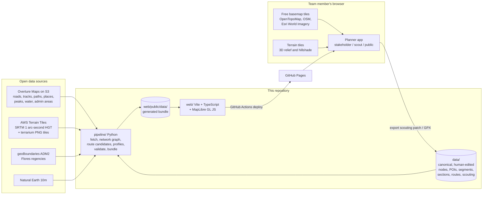

# Flores Race Planner — Architecture

A planning and visualization tool for an ultra-distance, self-supported adventure bike race across the
island of Flores (Nusa Tenggara Timur, Indonesia), in the spirit of the Silk Road Mountain Race:
1,000–2,000 km, remote, hard, on forgotten tracks and farmers' routes, with real hike-a-bike, and a
deliberate connection to the volcanoes, highlands, coasts, villages and history of the island.

This document is the architectural reference for the project. It explains *what* we are building,
*why* it is shaped this way, and *how* the pieces fit. Details live in `docs/`.

---

## 1. Audiences and what each one needs

| Audience | Needs | Mode in the app |
|---|---|---|
| **Stakeholders** (partners, local government, sponsors, communities) | The vision on one screen: the island, the candidate course, the highlights, honest numbers (km, climbing, % unpaved, hike-a-bike), a story per section, and how far the planning has progressed. | `stakeholder` |
| **Scouting team** (people who will ride, walk and drive the options) | Every candidate segment with its alternatives, what is known vs. guessed, elevation profiles, surface classes, water and resupply, the raw track network around each option, GPX in/out, a way to record verdicts in the field. | `scout` |
| **Public** (later, for promotion) | A teaser: the island, the spirit, a coarse route, highlights. Nothing that reveals sensitive details before the organisers decide to. | `public` |

The same application serves all three; the mode changes what is shown and what can be edited.

---

## 2. Design principles

1. **Static first, zero operations.** A static site on GitHub Pages. No servers, no databases, no API keys,
   nothing to pay for or keep alive. A backend can be added later behind a small interface (see §7.4).
2. **Git is the database.** Every route, segment, point of interest and scouting verdict is a file in
   `data/`. Changes are pull requests: reviewable, attributable, reversible, diff-able. It also means
   the whole planning state can be cloned to a laptop and used offline.
3. **Two layers of truth, never blurred.** Everything carries a `status` and a `confidence`. A
   *concept* line (what we imagine) is drawn differently from a *scouted* line (what a human verified).
   The UI never presents a guess as a fact.
4. **Provenance on every feature.** Each POI, node and segment records where it came from
   (`sources`) and how it was traced (`geometry_source`). Stakeholders can trust it; scouts can audit it.
5. **Field ready.** Low bandwidth tolerant, GPX export for GPS units, URL-shareable state, an editing
   flow that works from a phone in a village with no signal (edits are kept locally and exported).
6. **Reproducible derivations.** Everything under `web/public/data/` is generated by `pipeline/` from
   `data/` plus open datasets. Nobody hand-edits generated files.
7. **Open data, open licenses.** Overture Maps (OSM-derived), SRTM terrain, geoBoundaries, Natural Earth.
   Basemap tiles come from free public services with proper attribution. No proprietary lock-in.
8. **Cheap where cheap is enough.** The project is built with AI assistance under an explicit model
   tiering policy: frontier reasoning for architecture, route design and verification; smaller models
   for code generation, data formatting and mechanical work. See `docs/ai-workflow.md`.

---

## 3. System overview



Two execution environments, deliberately separated:

* **Pipeline (Python, offline-capable)** runs on a laptop or in GitHub Actions. It pulls open data,
  builds the track graph, proposes route candidates, samples elevation, validates the canonical data
  and writes the compact bundle the web app consumes. It is the only place heavy geoprocessing happens.
* **Web app (browser, static)** never calls a backend. It loads the bundle, draws it on MapLibre over
  free tiles, computes small things on the fly (stats roll-ups, GPX, profile rendering) and lets
  scouts record verdicts that are exported as a JSON patch and committed through a pull request.

---

## 4. Repository layout

```
Flores-Race/
├── ARCHITECTURE.md              this document
├── README.md                    quick start for the team
├── docs/
│   ├── data-model.md            field-by-field contract for data/ and the web bundle
│   ├── route-concept.md         the course concept: sections, anchors, alternatives, hazards
│   ├── scouting-protocol.md     how the field team records and submits verdicts
│   ├── ai-workflow.md           model tiering policy for AI-assisted work
│   ├── deployment.md            GitHub Pages setup, custom domain, public build
│   └── adr/                     architecture decision records
├── data/                        CANONICAL, human-edited (git is the database)
│   ├── nodes.geojson            anchor points: start, finish, checkpoints, towns, junctions
│   ├── pois.geojson             volcanoes, villages, beaches, heritage, hazards, resupply
│   ├── segments.geojson         candidate segments between nodes, with variants and status
│   ├── sections.json            narrative chapters of the course, ordered
│   ├── routes.json              route variants = ordered lists of segment ids
│   └── scouting/                field reports (markdown with front matter)
├── schemas/                     JSON Schema for every file in data/ and the bundle
├── pipeline/                    Python 3.11; see pipeline/README.md
│   ├── fetch_overture.py        Overture themes for the Flores bbox, straight from S3
│   ├── fetch_dem.py, dem.py     SRTM tiles and an elevation sampler
│   ├── fetch_boundaries.py      geoBoundaries regencies
│   ├── fetch_naturalearth.py    context layers
│   ├── build_network.py         routable graph + classification + remoteness index
│   ├── route_candidates.py      k alternatives between consecutive anchors, per cost profile
│   ├── build_profiles.py        elevation profiles and stats for segments and routes
│   ├── validate.py              schema + referential integrity checks for data/
│   ├── build_web_data.py        writes web/public/data/
│   └── requirements.txt
├── web/                         Vite + TypeScript + MapLibre GL JS (no UI framework)
│   ├── index.html
│   ├── src/
│   │   ├── main.ts              boot, mode selection, URL state
│   │   ├── state/               tiny reactive store, selection, mode, layer visibility
│   │   ├── data/                loaders, typed models (generated from schemas), RouteStore
│   │   ├── map/                 basemaps, terrain, layer definitions, styling by status
│   │   ├── panels/              sidebar, inspector, elevation profile, legend, scouting form
│   │   └── lib/                 geo helpers, GPX import/export, stats roll-ups
│   └── public/data/             GENERATED bundle (small files committed, large ones built in CI)
└── .github/workflows/
    ├── validate.yml             schema validation + web build on every PR
    └── deploy.yml               pipeline (light) + vite build → GitHub Pages on main
```

---

## 5. Canonical data (`data/`)

The course is modelled as a **graph of candidate segments between anchor nodes**, wrapped in a
**narrative of sections**, composed into **route variants**. Full field contract: `docs/data-model.md`.

| File | Geometry | What it holds |
|---|---|---|
| `nodes.geojson` | Point | Anchor points the course must pass through or may pass through: start, finish, checkpoints, towns, key villages, junctions. Resupply, water and sleeping options are recorded here. |
| `pois.geojson` | Point | The reasons the race exists: volcanoes, crater lakes, traditional villages, beaches, hot springs, heritage, viewpoints. Also hazards and logistics (ports, airports). Each has a short summary and a longer story for stakeholder mode, and a `public` flag. |
| `segments.geojson` | LineString | One candidate way to get from one node to another. Variants (`A`, `B`, `C`) of the same pair are alternatives to scout. Every segment carries `status`, `geometry_source`, character, estimated hike-a-bike, difficulty, remoteness, water, hazards, cultural notes, and a list of scouting verdicts. Derived stats are filled in by the pipeline. |
| `sections.json` | none | Ordered chapters (for example *"Manggarai highlands"*, *"Kelimutu and the Lio country"*) with the story, the theme, the highlight POIs and open questions. |
| `routes.json` | none | Route variants as ordered segment ids (for example *Traverse* ≈1,300 km, *Ultra* ≈1,800 km). The app computes totals from the segments. |
| `scouting/*.md` | none | Field reports with front matter: date, team, segments, verdict, notes. |

Identifier convention: kebab-case slugs with a type prefix (`n-ruteng`, `p-kelimutu`, `s-ruteng-reo-a`,
`sec-04-ngada`, `r-traverse`). Ids are stable; names can change.

Status vocabulary for segments, shared by pipeline, app and docs:

`concept` → `desk-checked` → `scouted-go` | `scouted-no-go` | `needs-recheck` → `confirmed`

---

## 6. Pipeline (`pipeline/`)

Python 3.11. Pure-Python geospatial stack (shapely, pyproj, numpy, pyarrow, networkx) so it installs
anywhere without GDAL. Every stage is a CLI with `--out`, idempotent, and caches downloads.

| Stage | Input | Output | Notes |
|---|---|---|---|
| `fetch_overture.py` | Overture S3 (latest release), bbox | GeoJSONL per type: segments, connectors, places, land (peaks), water, division areas | Reads GeoParquet over HTTPS with row-group pruning on the `bbox` column, so a whole-island extract is hundreds of MB, not the planet. OSM-derived, ODbL. |
| `fetch_dem.py` + `dem.py` | AWS terrain tiles (`skadi/*.hgt.gz`) | 8 SRTM 1-arc-second tiles; a `DEM` sampler with bilinear interpolation across tiles | Tiles include bathymetry; sample values below 0 are clamped to 0 on land profiles. |
| `fetch_boundaries.py` | geoBoundaries ADM2 | the 8 Flores regencies | CC BY 4.0. Used for outlines, per-regency stats and the island mask. |
| `build_network.py` | Overture segments + connectors + DEM | a routable graph (nodes = connectors, edges = segment pieces) with per-edge: length, class, surface, grade, remoteness index | Remoteness = distance to nearest primary/secondary road and to nearest place; used both for styling and for routing cost. |
| `route_candidates.py` | graph + `data/nodes.geojson` + `data/routes.json` anchor order | up to k candidate LineStrings per consecutive anchor pair per cost profile | Profiles: `remote` (prefer track/path, forbid trunk, heavy penalty on primary), `rideable` (prefer unpaved but rideable, penalise footway/path), `direct`. Alternatives via iterative edge penalisation. Written as `status: concept`, `geometry_source: overture-route` segments for scouts to accept, edit or reject; never overwrite a segment a human has touched. |
| `build_profiles.py` | segments + DEM | `profiles.json` (distance/elevation arrays), and `stats` filled into each segment: length, ascent, descent, min/max elevation, % unpaved | Ascent uses a smoothing window to avoid SRTM noise inflating climbing numbers. |
| `validate.py` | `data/` + `schemas/` | exit code | JSON Schema plus referential integrity (segments reference existing nodes, routes reference existing segments and form a connected chain, ids unique, statuses valid). Runs in CI. |
| `build_web_data.py` | everything above | `web/public/data/*` | Simplifies geometry for the web, gzips the network, writes `meta.json` with sources, licenses and the Overture release used. |

The pipeline is also where any future heavy analysis belongs (land cover from ESA WorldCover for
"forest vs. savanna" character, Sentinel-2 mosaics for an offline satellite layer, water-point
extraction from OSM tags). All of those sources are reachable from the same S3-style hosting.

---

## 7. Web application (`web/`)

### 7.1 Stack

* **Vite + TypeScript**, no UI framework. The UI is a handful of panels; vanilla modules with a tiny
  reactive store keep the code approachable for a small team and the bundle small.
* **MapLibre GL JS** (bundled from npm, not a CDN) for the map: vector rendering of our data, raster
  basemaps, hillshade and optional 3D terrain from terrarium tiles.
* **Hand-drawn SVG** for the elevation profile (no charting dependency).
* State is mirrored in the URL hash so any view is shareable:
  `#mode=scout&route=r-traverse&sel=s-ruteng-reo-a&c=120.47,-8.61&z=11&base=topo&layers=network,pois`.

### 7.2 Layers (bottom to top)

1. Basemap raster: OpenTopoMap (default for scouts), Esri World Imagery (satellite), OpenStreetMap.
2. Hillshade computed by MapLibre from AWS terrarium tiles; **3D terrain** toggle for stakeholder
   fly-throughs.
3. Regency outlines and the island mask (subtle).
4. **Track network** from Overture, styled by class and surface (track, path, unclassified, tertiary…;
   paved vs. unpaved). Off by default in stakeholder mode, on in scout mode above a zoom threshold.
5. **Candidate segments**, styled by `status` (dashed grey for `concept`, amber for `desk-checked`,
   green for `scouted-go`/`confirmed`, red for `scouted-no-go`), with non-selected variants faded.
6. **Nodes** (checkpoint diamonds) and **POIs** (icons by category), with labels.
7. Selection highlight and the "route so far" cumulative distance markers.

### 7.3 Panels and modes

| Panel | stakeholder | scout | public |
|---|---|---|---|
| Header: mode, basemap, layer toggles, search, share link | yes | yes | reduced |
| Left: route variant selector, section list with stats and stories, legend | yes | yes | sections only |
| Right inspector: selected POI or segment, all properties, sources, scouting history | POI + segment summary | everything, plus the **scouting form** | POI summary only |
| Bottom: elevation profile (whole route or selected segment), status progress bar | yes | yes | coarse profile |
| Story mode: fly from section to section with narrative | yes | no | yes |
| GPX export (route, section, or segment) and GPX import to compare a ridden track | export | export + import | no |

`public` mode is a *presentation* filter for now; because the repository is public, it is **not** a
security boundary (see §9).

### 7.4 Data access

All reads go through a `RouteStore` interface with one implementation today, `StaticFileStore`
(fetches the bundle). Scout edits are held in the browser (localStorage) as an overlay and exported as
`scouting-patch.json` following `schemas/scouting-patch.schema.json`; a maintainer applies the patch with
`pipeline/apply_patch.py` and opens a PR. If the team later wants live collaboration, a second
implementation (for example a small hosted database) slots in behind the same interface without
touching the map or panels.

---

## 8. Route computation model

The interesting engineering is in turning "we want it remote, hard and beautiful" into something a
computer can propose and a human can check.

1. **Anchors first.** Route design starts from a human decision: the ordered list of anchor nodes a
   variant must visit (`routes.json` → `anchors`). This is where the cultural and scenic intent lives.
2. **Candidates second.** For each consecutive anchor pair the pipeline proposes up to k alternatives
   per cost profile from the Overture graph. Costs are per-metre multipliers by class and surface,
   plus a remoteness bonus and a grade penalty tuned so that a farm track over a ridge beats a paved
   valley road. These arrive as `concept` segments with real geometry and computed stats.
3. **Humans decide third.** Scouts (and the route designer) accept, reject, split or hand-trace
   segments. Any human touch changes `geometry_source` and freezes the segment against regeneration.
4. **Totals are always derived.** Route length, climbing, % unpaved and hike-a-bike estimates are
   summed from the segments currently selected for the variant, so the stakeholder numbers are never
   typed by hand and never stale.

Until the network-derived candidates exist for a pair, the app shows the hand-sketched concept
corridor from `docs/route-concept.md`, clearly dashed.

---

## 9. Hosting, privacy and the public interface

* **Hosting:** GitHub Pages via GitHub Actions (`deploy.yml`), base path `/Flores-Race/`. Enabling it is
  a one-time repository setting (Settings → Pages → Source: *GitHub Actions*); see `docs/deployment.md`.
  A custom domain can be added later without code changes.
* **The repository is public.** That means every file in `data/`, including scouting notes, is readable
  by anyone who finds the repository. Recommendation: **make the repository private** for the planning
  phase, or keep sensitive material (landowner contacts, permission negotiations, exact final route)
  out of `data/` until launch. The `public` app mode hides things from view; it does not hide them from
  the internet.
* **Public site later:** produce it from the same code with a build-time filter (`VITE_PUBLIC_BUILD=1`)
  that strips non-`public` features from the bundle before deploying to a separate Pages site or
  domain. The mode flag then becomes redundant for the public build.
* **Attribution obligations:** OpenStreetMap/Overture (ODbL), OpenTopoMap (CC BY-SA), Esri World
  Imagery (Esri terms, attribution string), SRTM (public domain), geoBoundaries (CC BY 4.0). The
  attribution control in the app is generated from `meta.json`.

---

## 10. Environment notes from the build sandbox

These constraints shaped the pipeline and are worth knowing for CI:

| Host | Reachable from the sandbox | Used for |
|---|---|---|
| `overturemaps-us-west-2.s3.amazonaws.com` | yes | track network, places, peaks, water, admin areas |
| `elevation-tiles-prod.s3.amazonaws.com` | yes | SRTM HGT tiles, terrarium tiles |
| `copernicus-dem-30m.s3.*.amazonaws.com`, `esa-worldcover.s3.*`, `sentinel-cogs.s3.*` | yes | future: better DEM, land cover, satellite mosaic |
| `raw.githubusercontent.com`, `media.githubusercontent.com` | yes | Natural Earth, geoBoundaries |
| `registry.npmjs.org`, `pypi.org` | yes | dependencies |
| `fonts.googleapis.com` | yes | web fonts |
| OpenStreetMap API, Overpass mirrors, Geofabrik, Nominatim | **no** | (browser-side only, from the team's own network) |
| Tile servers (OSM, OpenTopoMap, Esri, MapTiler), CDNs (unpkg, cdnjs) | **no** | (browser-side only) — hence MapLibre is bundled, not CDN-loaded |
| Wikipedia, Wikidata | **no** | POI verification is done through web search summaries instead |

Consequence: the pipeline uses Overture (OSM-derived, on S3) instead of Overpass, and the browser,
not the pipeline, talks to tile servers.

---

## 11. Roadmap

| Phase | Deliverable | Status |
|---|---|---|
| 0 | Architecture, data model, route concept, pipeline, web app v0 with concept course, CI | this pull request |
| 1 | Network-derived candidates for every anchor pair; scouting protocol used in the first field trip; GPX round-trip tested on real devices | next |
| 2 | Offline field mode (PWA with cached tiles for the scouting corridor), photo attachments in reports | after first scouting season |
| 3 | Public teaser site from the filtered build; custom domain; story mode polish | when the organisers decide |
| 4 | Optional live collaboration backend behind `RouteStore` | only if git-as-database becomes a bottleneck |

---

## 12. Architecture decision records

* [ADR-0001 Static site, git as the database](docs/adr/0001-static-first-git-as-database.md)
* [ADR-0002 Segment graph with variants and statuses](docs/adr/0002-segment-graph-model.md)
* [ADR-0003 MapLibre GL with free tiles and no API keys](docs/adr/0003-maplibre-free-tiles-no-keys.md)
* [ADR-0004 Overture Maps on S3 as the track-network source](docs/adr/0004-overture-as-network-source.md)
* [ADR-0005 Model tiering for AI-assisted work](docs/adr/0005-model-tiering.md)
